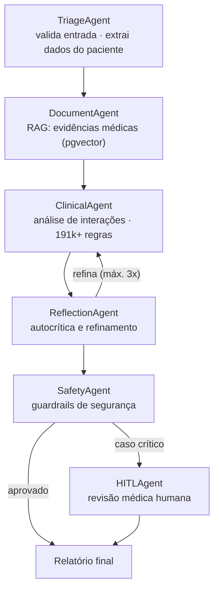

# MedSafe — Sistema Inteligente de Contraindicação de Medicamentos

> Sistema multi-agente (LangGraph) que analisa prescrições em busca de contraindicações medicamentosas — RAG sobre documentação médica, 191k+ regras de interação, guardrails de segurança e revisão humana (HITL). 100% local-first: a inferência roda em Ollama, sem enviar dados de paciente para APIs externas.

[](https://github.com/Aerdor1998/MedSafe/actions)
[](https://www.python.org/)
[](https://langchain-ai.github.io/langgraph/)
[](LICENSE)

## Por que existe

Interações medicamentosas são uma das principais causas evitáveis de eventos adversos em saúde. O MedSafe automatiza a triagem de prescrições cruzando os medicamentos do paciente contra uma base de **191k+ interações conhecidas** e evidências médicas recuperadas via RAG — mas mantém o médico no circuito: nenhum caso crítico é finalizado sem aprovação humana.

## Arquitetura — Multi-Agent System (LangGraph)



**Decisões de design:**

- **Reflection loop limitado a 3 iterações** — autocrítica melhora a análise clínica, mas precisa de teto para latência previsível.
- **Human-in-the-loop obrigatório** para casos sinalizados pelo SafetyAgent — IA sugere, médico decide.
- **LLM local (Ollama / qwen2.5:7b)** — dados de paciente nunca saem da infraestrutura (LGPD by design).
- **Guardrails em camadas**: validação de entrada → regras clínicas determinísticas → safety agent → HITL.

## Stack

| Componente | Tecnologia |
|------------|-----------|
| AI Framework | LangGraph 0.2.50+ (6 agentes especializados) |
| LLM | Ollama · qwen2.5:7b (inferência local) |
| RAG / Embeddings | PostgreSQL 16 + pgvector |
| Backend | FastAPI 0.115+ · Pydantic |
| OCR de prescrições | Tesseract + Vision AI |
| Cache / Filas | Redis 7 |
| Observabilidade | Prometheus + Grafana |
| Auth | JWT + RBAC |

## Quick Start

```bash
git clone https://github.com/Aerdor1998/MedSafe.git && cd MedSafe
cp env.example .env
./scripts/medsafe-full-start.sh
```

| Endpoint | URL |
|----------|-----|
| API | http://localhost:9001 |
| API Docs (Swagger) | http://localhost:9001/docs |
| Health Check | http://localhost:9001/healthz |
| Prometheus | http://localhost:9090 |
| Grafana | http://localhost:3001 |

<details>
<summary><strong>Desenvolvimento local (sem Docker completo)</strong></summary>

```bash
python3 -m venv .venv && source .venv/bin/activate
pip install -r requirements.txt
docker-compose up -d db redis
uvicorn backend.app.main:app --reload --host 0.0.0.0 --port 9001
```

</details>

## Exemplo de uso

```bash
POST /api/v2/triage
Content-Type: application/json

{
  "patient_data": {
    "age": 65,
    "weight": 70,
    "conditions": ["diabetes", "hypertension"]
  },
  "medications": ["Metformina", "Losartana", "AAS"]
}
```

A resposta inclui interações detectadas, severidade, evidências recuperadas via RAG e flag de revisão humana quando aplicável. Workflow completo via `POST /api/v2/langgraph/analyze`.

## Estrutura do projeto

```
MedSafe/
├── backend/app/
│   ├── langgraph_agents/   # StateGraph + 6 agentes (triage, RAG, clinical, reflection, safety, HITL)
│   ├── routers/            # API routes
│   ├── services/           # Lógica de negócio
│   ├── auth/               # JWT + RBAC
│   └── db/                 # Camada de dados (PostgreSQL + pgvector)
├── alembic/                # Migrations versionadas
├── data/                   # Base de interações (191k+ registros)
├── infra/                  # Prometheus + Grafana
└── tests/                  # Unit, integração e E2E
```

## Qualidade e segurança

- **CI (GitHub Actions)**: lint (Black/isort/Flake8) · type-check (MyPy) · testes unitários e de integração (coverage ≥ 60%) · security scan (Bandit, Safety, pip-audit) · build Docker com scan Trivy
- **Testes**: `pytest backend/tests/ --cov=backend/app`
- **Segurança**: rate limiting, security headers (CSP/HSTS), sanitização de inputs, logs de auditoria LGPD-compliant

## Limitações conhecidas

- A base de interações cobre os pares mais comuns; combinações raras dependem do RAG e exigem revisão humana.
- O modelo local (7B) prioriza privacidade sobre capacidade — casos ambíguos são roteados para HITL em vez de respondidos com baixa confiança.
- Ferramenta de **apoio à decisão**: não substitui avaliação médica.

## Licença

[MIT](LICENSE)
