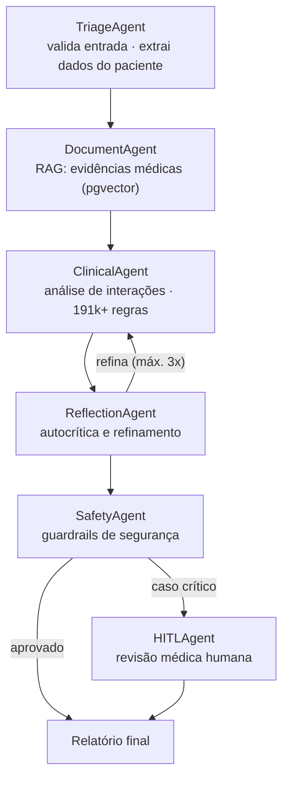

<div align="center">

<h1>MedSafe</h1>

<p><strong>Sistema Inteligente de Contraindicação de Medicamentos</strong> — IA multi-agente 100% local, com o médico no circuito.</p>

[](https://github.com/Aerdor1998/MedSafe/actions/workflows/ci.yml)
[](https://www.python.org/)
[](https://langchain-ai.github.io/langgraph/)
[](LICENSE)

[Por que existe](#por-que-existe) ·
[Arquitetura](#arquitetura--multi-agent-system-langgraph) ·
[Stack](#stack) ·
[Quick Start](#quick-start) ·
[Exemplo de uso](#exemplo-de-uso) ·
[Estrutura](#estrutura-do-projeto) ·
[Qualidade](#qualidade-e-segurança) ·
[Limitações](#limitações-conhecidas) ·
[Licença](#licença)

</div>

> Sistema multi-agente (LangGraph) que analisa prescrições em busca de contraindicações medicamentosas — RAG sobre documentação médica, 191k+ regras de interação, guardrails de segurança e revisão humana (HITL). 100% local-first: a inferência roda em Ollama, sem enviar dados de paciente para APIs externas.

## Por que existe

Interações medicamentosas são uma das principais causas evitáveis de eventos adversos em saúde. O MedSafe automatiza a triagem de prescrições cruzando os medicamentos do paciente contra uma base de **191k+ interações conhecidas** e evidências médicas recuperadas via RAG — mas mantém o médico no circuito: nenhum caso crítico é finalizado sem aprovação humana.

## Arquitetura — Multi-Agent System (LangGraph)



**Decisões de design:**

- **Reflection loop limitado a 3 iterações** — autocrítica melhora a análise clínica, mas precisa de teto para latência previsível.
- **Human-in-the-loop obrigatório** para casos sinalizados pelo SafetyAgent — IA sugere, médico decide.
- **LLM local (Ollama / MedGemma)** — dados de paciente permanecem na infraestrutura configurada.
- **Guardrails em camadas**: validação de entrada → regras clínicas determinísticas → safety agent → HITL.

## Stack

**IA & Agentes** (6 agentes especializados, inferência local)


**Backend & Dados**


**Observabilidade & Segurança**


## Quick Start

```bash
git clone https://github.com/Aerdor1998/MedSafe.git && cd MedSafe
cp env.example .env
./scripts/medsafe-full-start.sh
```

| Endpoint | URL |
|----------|-----|
| API | http://localhost:9001 |
| API Docs (Swagger) | http://localhost:9001/docs |
| Health Check | http://localhost:9001/healthz |
| Prometheus | http://localhost:9090 |
| Grafana | http://localhost:3001 |

Para uma implantação vendável, use o stack de produção e não o quick start:

```bash
cp env.prod.example .env
python scripts/preflight_prod.py --first-deploy --vercel
docker compose -f docker-compose.prod.yml up -d
```

O procedimento completo está no [runbook de produção](docs/RUNBOOK.md). Escopo de
oferta, limites multi-tenant e gates externos estão em
[COMMERCIAL_READINESS.md](COMMERCIAL_READINESS.md).

<details>
<summary><strong>Desenvolvimento local (sem Docker completo)</strong></summary>

```bash
python3 -m venv .venv && source .venv/bin/activate
pip install -r requirements.txt
docker-compose up -d db redis
uvicorn backend.app.main:app --reload --host 0.0.0.0 --port 9001
```

</details>

## Exemplo de uso

```bash
POST /api/v2/analyze
Content-Type: application/json

{
  "medication": "Varfarina",
  "patient_data": {
    "age": 65,
    "weight": 70,
    "conditions": ["diabetes tipo 2", "hipertensão"],
    "current_medications": ["Metformina", "Losartana", "AAS"]
  }
}
```

A análise roda de forma assíncrona (rate limit de 10 req/min, com suporte a `Idempotency-Key`): a resposta retorna um `session_id`, e o resultado — interações detectadas, contraindicações, nível de risco e score de confiança — é consultado via `GET /api/v2/status/{session_id}`. Casos críticos ficam pendentes até aprovação médica em `POST /api/v2/hitl/approve`.

## Estrutura do projeto

```
MedSafe/
├── backend/
│   ├── app/
│   │   ├── langgraph_agents/   # StateGraph + 6 agentes (triage, RAG, clinical, reflection, safety, HITL)
│   │   ├── routers/            # API routes
│   │   ├── services/           # Lógica de negócio
│   │   ├── auth/               # JWT + RBAC
│   │   ├── middleware/         # Security headers, rate limit, métricas
│   │   └── db/                 # Camada de dados (PostgreSQL + pgvector)
│   └── tests/                  # Testes unitários e de integração
├── alembic/                # Migrations versionadas
├── data/                   # Base de interações (191k+ registros)
├── infra/                  # Prometheus, Grafana, Nginx, Ollama
└── tests/e2e/              # Testes end-to-end
```

## Qualidade e segurança

- **CI (GitHub Actions)**: lint (Black/isort/Flake8) · type-check (MyPy) · testes unitários e de integração (coverage ≥ 60%) · security scan (Bandit, Safety, pip-audit) · build Docker com scan Trivy
- **Testes**: `pytest backend/tests/ --cov=backend/app`
- **Segurança**: rate limiting, security headers (CSP/HSTS), validação rigorosa de entrada (Pydantic), logs de auditoria LGPD-compliant

## Limitações conhecidas

- A base de interações cobre os pares mais comuns; combinações raras dependem do RAG e exigem revisão humana.
- O modelo local (8B) prioriza privacidade sobre capacidade — casos ambíguos são roteados para HITL em vez de respondidos com baixa confiança.
- Ferramenta de **apoio à decisão**: não substitui avaliação médica.

## Licença

[MIT](LICENSE)
