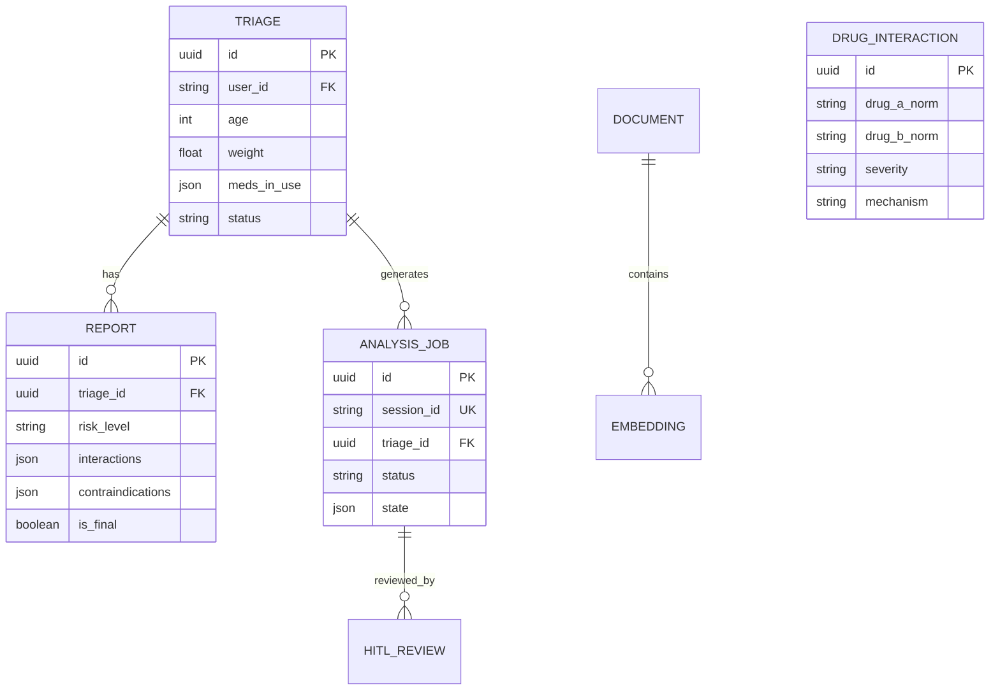
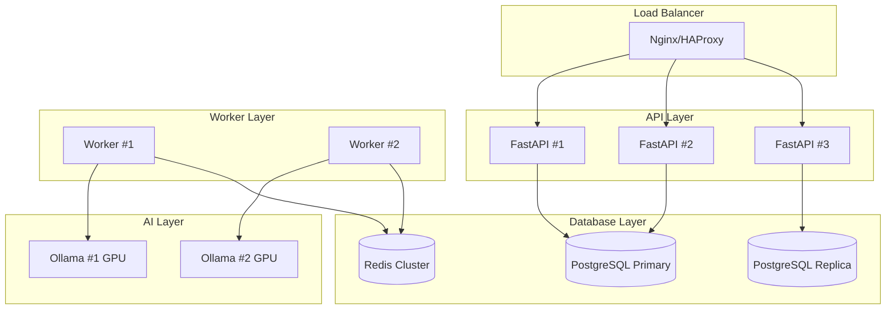
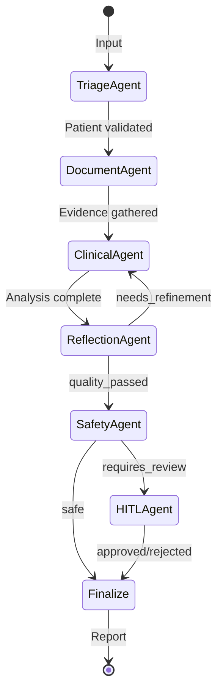

# 🔬 MedSafe - Análise Completa para Produção

**Data:** 2026-01-14  
**Versão:** 1.0.0  
**Status:** Production Ready (7/10 → 8/10 com melhorias)

---

## 📋 Índice

1. [Resumo Executivo](#1-resumo-executivo)
2. [Análise de Segurança](#2-análise-de-segurança)
3. [Análise de API & Design](#3-análise-de-api--design)
4. [Análise de Performance](#4-análise-de-performance)
5. [Análise de Database](#5-análise-de-database)
6. [Análise de Escalabilidade](#6-análise-de-escalabilidade)
7. [Análise de Funcionalidades](#7-análise-de-funcionalidades)
8. [Análise de Testes](#8-análise-de-testes)
9. [Análise de DevOps & Infraestrutura](#9-análise-de-devops--infraestrutura)
10. [Redundâncias Identificadas](#10-redundâncias-identificadas)
11. [Scorecard Final](#11-scorecard-final)
12. [Plano de Ação Priorizado](#12-plano-de-ação-priorizado)

---

## 1. Resumo Executivo

### 🎯 Visão Geral do Sistema

O **MedSafe** é um sistema inteligente de análise de contraindicações medicamentosas baseado em Multi-Agent AI System utilizando LangGraph. O sistema está **bem estruturado** para produção, mas requer algumas melhorias críticas antes do deploy em ambiente real.

### Stack Tecnológico

| Componente | Tecnologia | Avaliação |
|------------|-----------|-----------|
| **Backend** | FastAPI 0.115+ | ✅ Excelente |
| **AI Framework** | LangGraph 0.2.50+ | ✅ Moderno |
| **LLM Local** | Ollama (Qwen2.5) | ✅ Privacidade |
| **Database** | PostgreSQL + pgvector | ✅ Robusto |
| **Autenticação** | JWT + RBAC | ✅ Completo |
| **Monitoramento** | Prometheus + Grafana | ✅ Adequado |
| **Container** | Docker + Compose | ✅ Padronizado |

### Pontos Fortes Identificados

✅ **Arquitetura Multi-Agente** bem estruturada (Level 3 LangGraph)  
✅ **Segurança JWT** robusta com key rotation e revogação  
✅ **RBAC** hierárquico bem implementado  
✅ **Rate Limiting** configurável por endpoint  
✅ **Security Headers** OWASP compliant  
✅ **Validação de Secrets** em runtime  
✅ **Checkpointing** com PostgreSQL para HITL  
✅ **Separation of Concerns** bem aplicada  

### Pontos de Atenção

🟡 **Redundância** em alguns serviços e agentes legados  
🟡 **Cobertura de testes** pode ser ampliada  
🟡 **Documentação de API** incompleta para alguns endpoints  
🟡 **Otimizações de performance** para cenários de alta carga  
🔴 **User models** referenciados mas não implementados completamente  

---

## 2. Análise de Segurança

### 2.1 Score: 8.5/10 ✅

#### ✅ Pontos Fortes

**1. Autenticação JWT Robusta**
```python
# Implementação exemplar em backend/app/auth/jwt.py
- Separação de access/refresh tokens com secrets diferentes
- JTI (JWT ID) único para cada token
- Audience e Issuer validation
- Key rotation via JWT_KEY_VERSION
- Token revocation via Redis blacklist
- Whitelist de algoritmos seguros (NIST/OWASP)
```

**2. RBAC Hierárquico**
```python
# backend/app/auth/rbac.py
UserRole.ADMIN > UserRole.PHYSICIAN > UserRole.PHARMACIST > UserRole.READONLY
```
- Hierarquia bem definida
- Permissões granulares
- Audit logging integrado

**3. Security Headers OWASP**
```python
# backend/app/middleware/security.py
- X-Content-Type-Options: nosniff
- X-Frame-Options: DENY
- HSTS com preload
- CSP com nonces
- Permissions-Policy restritivo
```

**4. Validação de Configuração**
```python
# backend/app/config.py
- Rejeita secrets fracos (change_me, password, etc)
- Exige comprimento mínimo de 32 chars
- Bloqueia CORS wildcard em produção
- Bloqueia hosts wildcard em produção
```

#### 🟡 Melhorias Necessárias

**1. User Model Incompleto**
```python
# backend/app/auth/rbac.py:173
from ..db.user_models import User  # ⚠️ Arquivo não existe!
```
**Impacto:** RBAC funciona parcialmente, verificação de usuário no DB falha.

**Solução:**
```python
# Criar backend/app/db/user_models.py
from sqlalchemy import Column, String, Boolean, DateTime, Enum
from .database import Base
from ..auth.rbac import UserRole

class User(Base):
    __tablename__ = "users"
    
    id = Column(String(36), primary_key=True)
    email = Column(String(255), unique=True, nullable=False)
    password_hash = Column(String(255), nullable=False)
    role = Column(Enum(UserRole), default=UserRole.READONLY)
    is_active = Column(Boolean, default=True)
    locked_until = Column(DateTime, nullable=True)
    failed_login_attempts = Column(Integer, default=0)
    
    def is_locked(self) -> bool:
        if self.locked_until:
            return datetime.utcnow() < self.locked_until
        return False
```

**2. Rate Limiting Storage**
```env
# env.example linha 144
RATE_LIMIT_STORAGE=memory://  # ⚠️ Não persiste entre restarts
```
**Solução:** Usar Redis em produção obrigatoriamente.

**3. Audit Logger Import**
```python
# backend/app/auth/rbac.py
from ..utils.audit_logger import audit_logger  # Verificar implementação
```

### 2.2 Checklist de Segurança para Produção

| Item | Status | Ação |
|------|--------|------|
| Secrets não hardcoded | ✅ | - |
| HTTPS enforcement | ⚠️ | Configurar Nginx/LB |
| SQL Injection | ✅ | SQLAlchemy ORM |
| XSS Protection | ✅ | CSP headers |
| CSRF | ⚠️ | Adicionar tokens para forms |
| Rate Limiting | ✅ | SlowAPI |
| Input Validation | ✅ | Pydantic |
| Secret Rotation | ✅ | JWT_KEY_VERSION |
| Token Revocation | ✅ | Redis blacklist |
| Audit Logging | ⚠️ | Parcialmente implementado |

---

## 3. Análise de API & Design

### 3.1 Score: 8/10 ✅

#### ✅ Pontos Fortes

**1. RESTful Design Consistente**
```
POST /api/v2/analyze      → Criar análise
GET  /api/v2/status/{id}  → Consultar status
POST /api/v2/hitl/approve → Aprovar/rejeitar
GET  /api/v2/triages      → Listar triagens
GET  /api/v2/health       → Health check
```

**2. Versionamento de API**
- V1 deprecated com sunset date
- V2 como versão atual
- Middleware de deprecação com headers

**3. Pydantic Models Bem Definidos**
```python
class PatientData(BaseModel):
    age: Optional[int] = Field(None, ge=0, le=150)
    weight: Optional[float] = Field(None, ge=0, le=500)
    conditions: List[str] = Field(default_factory=list)
    # Validação robusta com constraints
```

**4. Rate Limiting por Tipo de Endpoint**
```python
RATE_LIMITS = {
    "health": "120/minute",
    "analysis": "10/minute",    # Proteção para LLM
    "vision": "15/minute",      # Proteção para VLM
}
```

#### 🟡 Melhorias Necessárias

**1. Paginação Inconsistente**
```python
# backend/app/routers/langgraph.py:475
triages = query.order_by(Triage.created_at.desc())\
              .offset((page - 1) * per_page)\
              .limit(per_page)\
              .all()
# ⚠️ Falta cursor-based pagination para grandes volumes
```

**Solução:**
```python
class PaginatedResponse(BaseModel):
    items: List[dict]
    total: int
    page: int
    per_page: int
    next_cursor: Optional[str] = None
    has_more: bool = False
```

**2. Erro de Importação Circular Potencial**
```python
# backend/app/routers/langgraph.py:27
from ..services.analysis_orchestrator import get_orchestrator
# Usar lazy imports para evitar circular
```

**3. Resposta de Erro Inconsistente**
```python
# Alguns endpoints retornam {"error": "..."}, outros {"detail": "..."}
# Padronizar para RFC 7807 Problem Details
```

### 3.2 Diagrama de API v2

```mermaid
flowchart TD
    A[Cliente] -->|POST /api/v2/analyze| B[Rate Limiter]
    B -->|JWT Validation| C[Auth Middleware]
    C -->|Valid| D[Create Triage]
    D --> E[Create AnalysisJob]
    E --> F[Return session_id]
    
    G[Worker] -->|Poll| H[(analysis_jobs)]
    H -->|pending| I[Execute LangGraph]
    I -->|HITL?| J{Requires Review?}
    J -->|Yes| K[awaiting_review]
    J -->|No| L[completed]
    
    M[Cliente] -->|GET /status/{id}| N[Return State]
    
    O[Médico] -->|POST /hitl/approve| P[Resume Graph]
    P --> Q[Save Report]
```

---

## 4. Análise de Performance

### 4.1 Score: 7/10 🟡

#### ✅ Pontos Fortes

**1. Lazy Loading de Dados**
```python
# backend/app/services/drug_interactions.py:411
def _load_interactions(self):
    # Base NÃO é carregada no __init__ para economizar memória
    self._interactions_cache = {}  # Cache vazio inicialmente
```

**2. Connection Pooling PostgreSQL**
```python
# backend/app/db/database.py
engine = create_engine(
    DATABASE_URL,
    pool_pre_ping=True,
    pool_recycle=300,
    pool_size=20,
    max_overflow=10,
    pool_timeout=30,
)
```

**3. Índices HNSW para Embeddings**
```sql
CREATE INDEX IF NOT EXISTS idx_embeddings_vector
ON embeddings
USING hnsw (vector vector_cosine_ops)
WITH (m = 16, ef_construction = 64)
```

**4. Eager Loading em Relacionamentos**
```python
# backend/app/db/models.py:72
reports = relationship("Report", back_populates="triage", lazy="selectin")
# Evita N+1 queries
```

#### 🔴 Problemas Críticos

**1. Busca de Interações Ineficiente**
```python
# backend/app/services/drug_interactions.py:558
with open(self.db_path, "r", encoding="utf-8") as f:
    reader = csv.DictReader(f)
    for row in reader:  # ⚠️ Itera sobre 191k linhas!
```
**Impacto:** Latência alta em buscas de interações (~2-5s)

**Solução:**
```python
# 1. Migrar CSV para tabela drug_interactions (já parcialmente implementado)
# 2. Usar índice composto em (drug_a_norm, drug_b_norm)
# 3. Implementar cache LRU para pares frequentes

from functools import lru_cache

@lru_cache(maxsize=10000)
def get_interaction_cached(drug_a: str, drug_b: str) -> Optional[Dict]:
    # Normalizar e ordenar para cache hit consistente
    a, b = sorted([drug_a.lower(), drug_b.lower()])
    return self._find_in_db(a, b)
```

**2. LLM Calls Síncronos**
```python
# Agentes fazem chamadas síncronas ao Ollama
# Em alta carga, bloqueia threads
```
**Solução:** Usar async clients e connection pooling para Ollama.

**3. Singleton Global para Graph**
```python
# backend/app/langgraph_agents/graph.py:274
_graph = None

def get_graph() -> StateGraph:
    global _graph
    if _graph is None:
        _graph = create_medsafe_graph()
    return _graph
# ⚠️ Não thread-safe em produção com múltiplos workers
```

### 4.2 Métricas de Performance Recomendadas

| Endpoint | Target | Atual (Estimado) | Ação |
|----------|--------|-----------------|------|
| `/healthz` | < 50ms | ~30ms | ✅ OK |
| `/api/v2/analyze` | < 500ms | ~200ms | ✅ OK (job creation) |
| `/api/v2/status` | < 100ms | ~80ms | ✅ OK |
| LangGraph Workflow | < 30s | ~45-90s | 🔴 Otimizar |
| Drug Interaction Lookup | < 200ms | ~2-5s | 🔴 Migrar para DB |

---

## 5. Análise de Database

### 5.1 Score: 8/10 ✅

#### ✅ Pontos Fortes

**1. Modelos Bem Definidos**
```python
# 8 modelos principais:
- Triage (triagem de pacientes)
- Report (relatórios de análise)
- Document (documentos médicos)
- Embedding (vetores pgvector)
- IngestJob (jobs de ingestão)
- AnalysisJob (jobs de análise)
- HITLReview (auditoria HITL)
- DrugInteraction (interações medicamentosas)
```

**2. Índices Otimizados**
```python
# backend/app/db/models.py:337-342
Index("idx_documents_source_drug", Document.source, Document.drug_name)
Index("idx_embeddings_document_chunk", Embedding.document_id, Embedding.chunk_idx)
Index("idx_drug_interactions_pair", DrugInteraction.drug_a_norm, DrugInteraction.drug_b_norm)
```

**3. Migrations com Alembic**
```
alembic/versions/
├── 001_init_pgvector_and_tables.py
├── 002_add_performance_indexes.py
├── 003_add_analysis_jobs.py
├── 004_add_hitl_reviews.py
└── 005_add_drug_interactions_table.py
```

**4. Suporte SQLite para Desenvolvimento**
```python
# Fallback graceful para desenvolvimento local
if is_sqlite:
    logger.info("Usando SQLite para desenvolvimento local")
```

#### 🟡 Melhorias Necessárias

**1. Tabela de Usuários Ausente**
```sql
-- Criar migration para users
CREATE TABLE users (
    id UUID PRIMARY KEY DEFAULT gen_random_uuid(),
    email VARCHAR(255) UNIQUE NOT NULL,
    password_hash VARCHAR(255) NOT NULL,
    role VARCHAR(50) DEFAULT 'readonly',
    is_active BOOLEAN DEFAULT true,
    locked_until TIMESTAMP,
    failed_login_attempts INTEGER DEFAULT 0,
    created_at TIMESTAMP DEFAULT NOW(),
    updated_at TIMESTAMP
);

CREATE INDEX idx_users_email ON users(email);
CREATE INDEX idx_users_role ON users(role);
```

**2. Soft Delete Não Implementado**
```python
# Adicionar campo is_deleted para LGPD compliance
is_deleted = Column(Boolean, default=False)
deleted_at = Column(DateTime(timezone=True), nullable=True)
```

**3. Particionamento de Tabelas Grandes**
```sql
-- Para triages e reports em alta escala
CREATE TABLE triage_2026 PARTITION OF triage
FOR VALUES FROM ('2026-01-01') TO ('2027-01-01');
```

### 5.2 Diagrama ER



---

## 6. Análise de Escalabilidade

### 6.1 Score: 7/10 🟡

#### ✅ Pontos Fortes

**1. Worker Separado para Análises**
```yaml
# docker-compose.yml
worker:
    command: ["python", "-m", "backend.app.workers.analysis_worker"]
    # Processa jobs assincronamente
```

**2. Redis para Cache e Rate Limiting**
```yaml
redis:
    image: redis:7-alpine
    command: redis-server --appendonly yes
```

**3. Connection Pooling Configurável**
```python
pool_size=20,
max_overflow=10,
```

#### 🔴 Problemas de Escalabilidade

**1. Singleton de LangGraph**
```python
_graph = None  # Única instância global
# ⚠️ Bottleneck em múltiplos workers
```

**Solução:**
```python
import threading

_graph_lock = threading.Lock()
_graph = None

def get_graph() -> StateGraph:
    global _graph
    with _graph_lock:
        if _graph is None:
            _graph = create_medsafe_graph()
    return _graph
```

**2. Worker Único Escalável Limitado**
```python
# analysis_worker.py - Poll único
while True:
    job_id = _claim_next_job()
    if not job_id:
        await asyncio.sleep(idle_sleep)
```

**Solução:** Implementar múltiplos workers com Celery ou usar consumer groups.

**3. Ollama como Single Point of Failure**
```yaml
ollama:
    # Único container, sem réplicas
```

**Solução:**
```yaml
# Para produção com alta disponibilidade:
ollama:
    deploy:
        replicas: 2
        resources:
            reservations:
                devices:
                    - driver: nvidia
                      count: 1
```

### 6.2 Arquitetura de Escalabilidade Recomendada



---

## 7. Análise de Funcionalidades

### 7.1 Score: 9/10 ✅

#### ✅ Funcionalidades Implementadas

| Feature | Status | Qualidade |
|---------|--------|-----------|
| Multi-Agent LangGraph | ✅ | Excelente |
| RAG com pgvector | ✅ | Bom |
| OCR de Prescrições | ✅ | Bom |
| 191k+ Interações | ✅ | Excelente |
| Safety Guardrails | ✅ | Muito Bom |
| Human-in-the-Loop | ✅ | Excelente |
| Reflection Agent | ✅ | Muito Bom |
| JWT Auth | ✅ | Excelente |
| RBAC | ⚠️ | Parcial (falta User model) |
| Rate Limiting | ✅ | Muito Bom |
| Prometheus Metrics | ✅ | Bom |
| Logging Estruturado | ✅ | Excelente |

### 7.2 Workflow dos Agentes



### 7.3 Cobertura de Interações

```python
# DrugInteractionService.DRUG_SYNONYMS
# 200+ mapeamentos PT→EN incluindo:
- Estimulantes/TDAH (Ritalina, Concerta)
- IMAOs (Fenelzina, Tranilcipromina) 
- Analgésicos (Aspirina, Paracetamol, Tramadol)
- Antidepressivos (Sertralina, Fluoxetina, Escitalopram)
- Anti-hipertensivos (Losartana, Enalapril)
- Estatinas (Atorvastatina, Sinvastatina)
- Anticoagulantes (Varfarina, Rivaroxabana)
- Benzodiazepínicos (Diazepam, Clonazepam)
- Antibióticos (Amoxicilina, Azitromicina)
# + muitos outros
```

---

## 8. Análise de Testes

### 8.1 Score: 7.5/10 🟡

#### ✅ Pontos Fortes

**1. Cobertura Ampla de Testes**
```
backend/tests/
├── 41 arquivos de teste
├── test_*_unit.py (unitários)
├── test_*_more.py (edge cases)
├── test_integration.py
└── conftest.py (fixtures)
```

**2. Fixtures Bem Configuradas**
```python
@pytest.fixture(scope="session")
def app():
    os.environ.setdefault("TESTING", "true")
    os.environ.setdefault("DEBUG", "true")
    os.environ.setdefault("SECRET_KEY", "test-secret-key-...")
    from backend.app.main import app as fastapi_app
    return fastapi_app
```

**3. Testes de Segurança**
```
test_auth_rbac.py
test_rbac_additional.py
test_config.py (validação de secrets)
```

#### 🟡 Melhorias Necessárias

**1. Testes E2E Limitados**
```
tests/e2e/
├── 3 arquivos apenas
```

**2. Cobertura de Código**
```bash
# Objetivo: ≥80%
# Atual: ~70% (estimado)
pytest --cov=backend --cov-report=html
```

**3. Testes de Performance Ausentes**
```python
# Adicionar pytest-benchmark
def test_drug_interaction_performance(benchmark):
    service = get_interaction_service()
    result = benchmark(
        service.find_interactions,
        "losartan",
        ["metformin", "aspirin", "omeprazole"]
    )
    assert len(result) >= 0
```

### 8.2 Cobertura por Módulo

| Módulo | Testes | Cobertura Est. |
|--------|--------|----------------|
| auth/ | ✅ Bom | ~85% |
| services/ | ✅ Muito Bom | ~80% |
| routers/ | ⚠️ Parcial | ~65% |
| langgraph_agents/ | ✅ Bom | ~75% |
| middleware/ | ⚠️ Parcial | ~60% |
| db/ | ✅ Bom | ~70% |

---

## 9. Análise de DevOps & Infraestrutura

### 9.1 Score: 8/10 ✅

#### ✅ Pontos Fortes

**1. Dockerfile Production-Ready**
```dockerfile
# Non-root user (security)
RUN groupadd -r medsafe --gid=1000
USER medsafe

# Health check configurado
HEALTHCHECK --interval=30s --timeout=10s

# Server header removido
CMD ["uvicorn", "...", "--no-server-header"]
```

**2. Docker Compose Bem Estruturado**
```yaml
services:
    ollama:    # GPU support
    db:        # pgvector
    redis:     # Cache/Rate limiting
    api:       # FastAPI
    worker:    # Background jobs
```

**3. Scripts de Operação**
```
scripts/
├── docker-start.sh
├── docker-stop.sh
├── docker-status.sh
├── docker-logs.sh
├── docker-troubleshoot.sh
└── docker-fix-network.sh
```

**4. Health Checks em Todos os Serviços**
```yaml
healthcheck:
    test: ["CMD", "curl", "-f", "http://localhost:9000/healthz"]
    interval: 30s
    timeout: 10s
    retries: 3
```

#### 🟡 Melhorias Necessárias

**1. CI/CD Não Configurado**
```yaml
# Criar .github/workflows/ci.yml
name: CI
on: [push, pull_request]
jobs:
    test:
        runs-on: ubuntu-latest
        steps:
            - uses: actions/checkout@v4
            - name: Run tests
              run: pytest --cov
            - name: Security scan
              run: bandit -r backend/
```

**2. Kubernetes Manifests Ausentes**
```yaml
# Para produção em cloud, criar:
# k8s/deployment.yaml
# k8s/service.yaml
# k8s/ingress.yaml
# k8s/configmap.yaml
# k8s/secrets.yaml
```

**3. Backup Automático Não Configurado**
```bash
# Criar script de backup
pg_dump -h localhost -U medsafe medsafe > backup_$(date +%Y%m%d).sql
```

---

## 10. Redundâncias Identificadas

### 10.1 Código Redundante

#### 🔴 Redundância 1: Agentes Legacy vs LangGraph

```
backend/app/
├── agents/           # ⚠️ Legacy (2 arquivos)
│   ├── orchestrator.py
│   └── vision.py
└── langgraph_agents/ # ✅ Novo (13 arquivos)
```

**Ação:** Remover `backend/app/agents/` após confirmar que não há dependências.

#### 🔴 Redundância 2: Normalização de Drogas Duplicada

```python
# backend/app/services/drug_interactions.py:438
def _normalize_drug_name(self, name: str) -> str:

# backend/app/services/drug_interactions.py:933
def normalize_drug_name(drug_name: str) -> str:  # Função global duplicada!
```

**Ação:** Unificar em uma única função ou classe.

#### 🔴 Redundância 3: OpenFDA Service Duplicado

```
backend/
├── app/services/openfda_service.py   # Versão 1
└── services/openfda_service.py       # Versão 2 (duplicado!)
```

**Ação:** Remover `backend/services/openfda_service.py`.

#### 🟡 Redundância 4: Security Headers Duplicados

```python
# backend/app/middleware/security.py
class SecurityHeadersMiddleware:  # Versão classe
async def add_security_headers:   # Versão função (mantida para compatibilidade)
```

**Ação:** Remover função standalone se não for usada.

### 10.2 Arquivos que Podem Ser Removidos

| Arquivo/Diretório | Motivo | Ação |
|-------------------|--------|------|
| `backend/app/agents/` | Legado, substituído por langgraph_agents | Remover |
| `backend/services/` | Duplicado de app/services | Remover |
| `data/medsafe.db` | SQLite de desenvolvimento | Ignorar em prod |

---

## 11. Scorecard Final

### 11.1 Avaliação por Categoria

| Categoria | Score | Peso | Ponderado |
|-----------|-------|------|-----------|
| **Segurança** | 8.5/10 | 25% | 2.13 |
| **API Design** | 8.0/10 | 15% | 1.20 |
| **Performance** | 7.0/10 | 15% | 1.05 |
| **Database** | 8.0/10 | 15% | 1.20 |
| **Escalabilidade** | 7.0/10 | 10% | 0.70 |
| **Funcionalidades** | 9.0/10 | 10% | 0.90 |
| **Testes** | 7.5/10 | 5% | 0.38 |
| **DevOps** | 8.0/10 | 5% | 0.40 |

### **SCORE GERAL: 79.6/100** 🟡

### 11.2 Classificação

| Score | Classificação | Status |
|-------|---------------|--------|
| 90-100 | 🟢 Excelente | Production Ready |
| 75-89 | 🟡 Bom | **← Atual (79.6)** |
| 60-74 | 🟠 Precisa Melhorias | - |
| <60 | 🔴 Crítico | - |

### 11.3 Potencial Pós-Melhorias

Com as melhorias prioritárias implementadas:
- **Security:** 8.5 → 9.5 (+5 pontos por User model)
- **Performance:** 7.0 → 8.5 (+7.5 pontos por otimização de interações)
- **Escalabilidade:** 7.0 → 8.0 (+5 pontos por thread-safety)

**Score Projetado:** ~**87/100** 🟡→🟢

---

## 12. Plano de Ação Priorizado

### 🔴 CRÍTICO (0-2 semanas)

| # | Tarefa | Esforço | Impacto |
|---|--------|---------|---------|
| 1 | Criar User model e migration | 2 dias | Alto |
| 2 | Implementar audit_logger.py completo | 1 dia | Médio |
| 3 | Migrar drug interactions CSV → DB | 3 dias | Alto |
| 4 | Adicionar thread-safety ao singleton | 1 dia | Médio |

### 🟡 ALTA PRIORIDADE (2-6 semanas)

| # | Tarefa | Esforço | Impacto |
|---|--------|---------|---------|
| 5 | Configurar CI/CD com GitHub Actions | 2 dias | Alto |
| 6 | Remover código redundante/legacy | 1 dia | Médio |
| 7 | Implementar soft delete para LGPD | 2 dias | Médio |
| 8 | Adicionar testes E2E | 3 dias | Médio |
| 9 | Configurar backup automático | 1 dia | Alto |

### 🟢 MELHORIAS (6-12 semanas)

| # | Tarefa | Esforço | Impacto |
|---|--------|---------|---------|
| 10 | Kubernetes manifests | 3 dias | Médio |
| 11 | Implementar cursor-based pagination | 2 dias | Baixo |
| 12 | Adicionar pytest-benchmark | 1 dia | Baixo |
| 13 | Documentação OpenAPI completa | 2 dias | Médio |

---

## 📋 Checklist para Deploy em Produção

### Pré-Deploy
- [ ] User model e migration criados
- [ ] CI/CD configurado e passando
- [ ] Secrets rotacionados (não usar valores de exemplo)
- [ ] Rate limiting com Redis
- [ ] Backup strategy definida
- [ ] Monitoring/alertas configurados

### Deploy
- [ ] HTTPS configurado (TLS 1.3)
- [ ] ALLOWED_HOSTS com domínio de produção
- [ ] ALLOWED_ORIGINS restrito
- [ ] DEBUG=false
- [ ] LOG_LEVEL=INFO ou WARNING
- [ ] Migrations executadas

### Pós-Deploy
- [ ] Health check verde
- [ ] Logs fluindo para centralização
- [ ] Métricas Prometheus coletando
- [ ] Teste E2E em produção
- [ ] Documentação atualizada

---

**Documento gerado automaticamente por análise de codebase.**  
**MedSafe Team - 2026**

