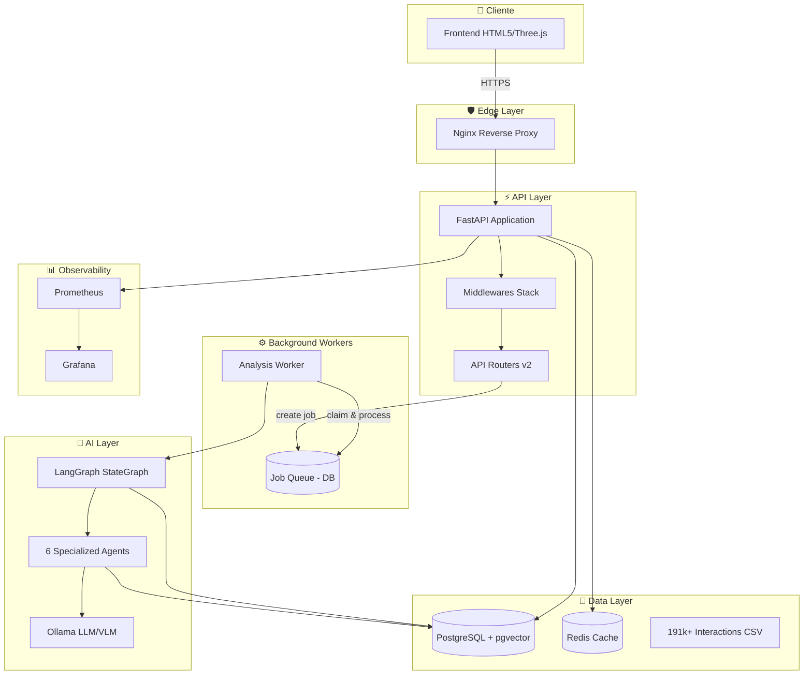
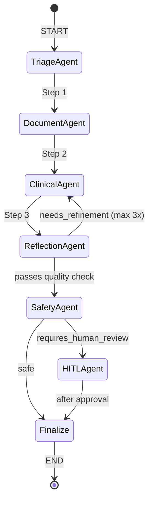
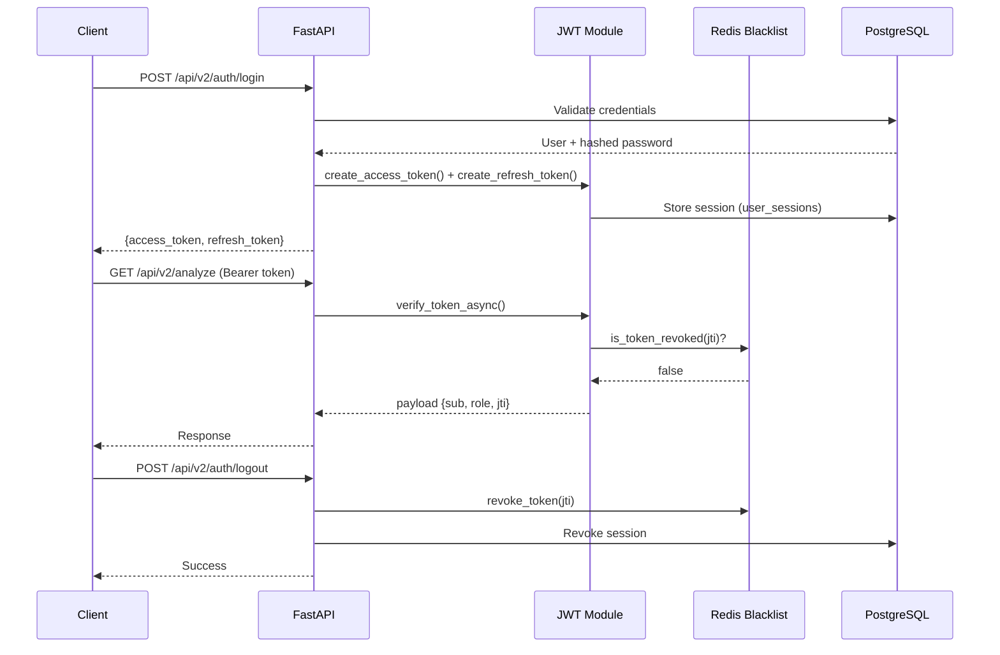
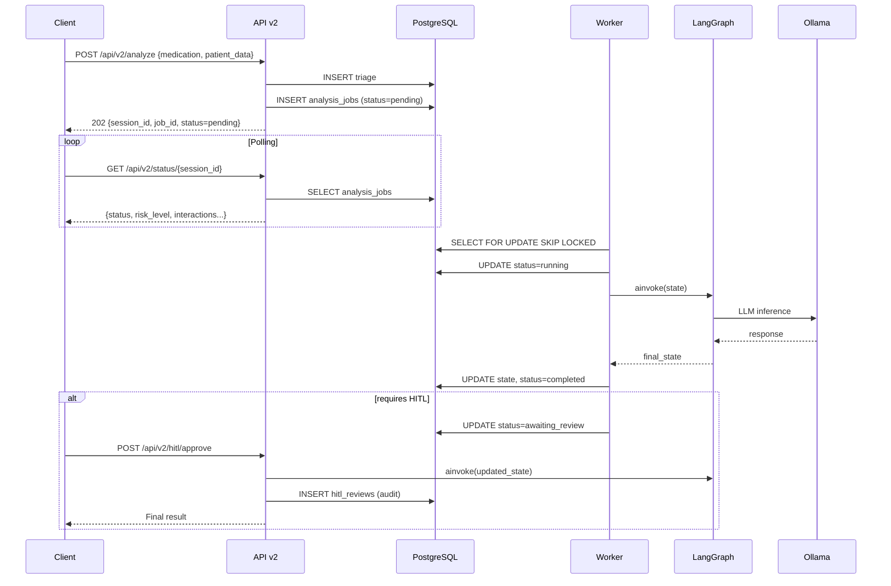
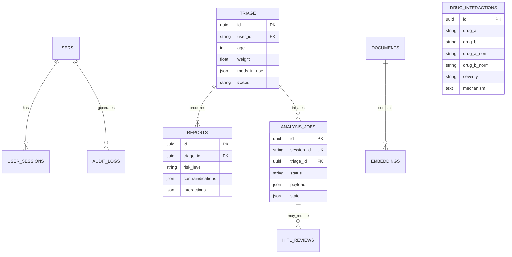
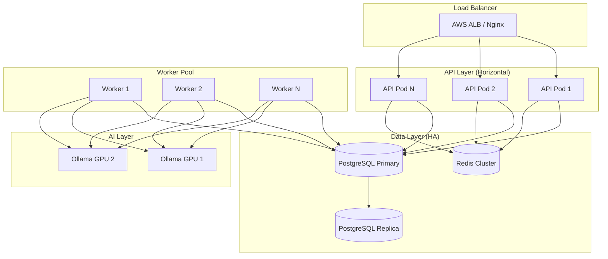

# 🏥 MedSafe - Análise Completa para Produção

**Data:** 2026-01-14  
**Versão:** 2.0.0-langgraph  
**Status:** Em análise para produção

---

## 📊 Scorecard Executivo

| Categoria | Score | Status |
|-----------|-------|--------|
| **Arquitetura** | 8.5/10 | 🟢 Excelente |
| **Segurança** | 7.5/10 | 🟡 Bom (melhorias necessárias) |
| **Performance** | 7/10 | 🟡 Bom |
| **API Design** | 8/10 | 🟢 Excelente |
| **Database** | 8/10 | 🟢 Excelente |
| **Escalabilidade** | 6.5/10 | 🟡 Adequado (limitações) |
| **Testes** | 7/10 | 🟡 Bom |
| **Observabilidade** | 7.5/10 | 🟡 Bom |
| **LGPD/Compliance** | 7/10 | 🟡 Bom (gaps a resolver) |
| **Documentação** | 8/10 | 🟢 Excelente |

**SCORE GERAL: 75/100** 🟡 **Pronto com ressalvas**

---

## 1. 🏗️ Análise de Arquitetura

### 1.1 Visão Geral



### 1.2 Padrões Arquiteturais Implementados

| Padrão | Implementação | Status |
|--------|--------------|--------|
| **Multi-Agent System (LangGraph Level 3)** | 6 agentes especializados com orquestração | ✅ Implementado |
| **RAG (Retrieval-Augmented Generation)** | pgvector + DocumentAgent | ✅ Implementado |
| **HITL (Human-in-the-Loop)** | Workflow com interrupt/resume | ✅ Implementado |
| **Reflection Pattern** | ReflectionAgent com max 3 ciclos | ✅ Implementado |
| **Repository Pattern** | SQLAlchemy + Services | ✅ Implementado |
| **Factory Pattern** | `create_app()`, `get_graph()` | ✅ Implementado |
| **Singleton (Thread-Safe)** | Graph, Services com locks | ✅ Implementado |
| **Dependency Injection** | FastAPI Depends | ✅ Implementado |

### 1.3 Agentes LangGraph



| Agente | Responsabilidade | Status |
|--------|------------------|--------|
| **TriageAgent** | Validar dados do paciente | ✅ |
| **DocumentAgent** | RAG - busca evidências médicas | ✅ |
| **ClinicalAgent** | Análise de interações (191k+ base) | ✅ |
| **ReflectionAgent** | Auto-crítica e refinamento | ✅ |
| **SafetyAgent** | Guardrails de segurança | ✅ |
| **HITLAgent** | Aprovação médica | ✅ |

### 1.4 ✅ Pontos Fortes

1. **Arquitetura modular** bem separada (routers, services, agents)
2. **LangGraph Level 3** com StateGraph tipado e checkpointing
3. **Worker assíncrono** para processamento durável
4. **Feature flags** para deprecação gradual de APIs
5. **Application Factory Pattern** (`create_app()`)
6. **Thread-safe singletons** com double-checked locking

### 1.5 ⚠️ Pontos de Atenção

1. **Código legado coexistindo** (`backend/app/agents/` vs `langgraph_agents/`)
2. **Checkpointing via DB** (AnalysisJob) ao invés de LangGraph nativo
3. **Dependência de Ollama local** sem fallback cloud robusto

---

## 2. 🔒 Análise de Segurança

### 2.1 Autenticação & Autorização



#### Implementações de Segurança

| Feature | Status | Detalhes |
|---------|--------|----------|
| **JWT com JTI único** | ✅ | UUID por token |
| **Issuer/Audience validation** | ✅ | `medsafe-api` / `medsafe-client` |
| **Algorithm whitelist** | ✅ | HS256, HS384, HS512, RS*, ES*, PS* |
| **Key rotation** | ✅ | `jwt_key_version` incrementável |
| **Token revocation (Redis)** | ✅ | Blacklist com TTL |
| **Refresh token rotation** | ✅ | Novo token a cada refresh |
| **Account lockout** | ✅ | 5 tentativas = 30min lock |
| **RBAC (Roles)** | ✅ | ADMIN, OPERATOR, READONLY |
| **Audit logging** | ✅ | Eventos de auth persistidos |

### 2.2 Security Headers & CORS

```python
# Implementados em backend/app/middleware/security.py
Security Headers:
- X-Content-Type-Options: nosniff
- X-Frame-Options: DENY
- X-XSS-Protection: 1; mode=block
- Strict-Transport-Security: max-age=31536000; includeSubDomains; preload
- Content-Security-Policy: (configurável)
- Referrer-Policy: strict-origin-when-cross-origin
- Permissions-Policy: (bloqueia câmera, geolocalização, etc.)
```

### 2.3 🔴 Vulnerabilidades Críticas

| ID | Severidade | Problema | Impacto | Solução |
|----|------------|----------|---------|---------|
| S1 | 🔴 CRÍTICO | PHI em `analysis_jobs.state` (DB) | Vazamento LGPD | Criptografia at-rest + política retenção |
| S2 | 🔴 CRÍTICO | Logs podem conter medicações em plaintext | Compliance | Implementar redaction filter central |
| S3 | 🟡 ALTO | CSP com `'unsafe-inline'` | XSS possível | Build pipeline + CSP strict mode |
| S4 | 🟡 ALTO | Upload sem validação magic-bytes | Bypass de tipo | Validar conteúdo real (PDF/imagem) |

### 2.4 Checklist de Segurança para Produção

- [x] Secrets não hardcoded (via .env)
- [x] Validação de SECRET_KEY/JWT_SECRET em produção
- [x] CORS restritivo (sem wildcard em prod)
- [x] TrustedHostMiddleware habilitado
- [x] Rate limiting implementado
- [x] Healthcheck sem exposição de dados sensíveis
- [x] Dockerfile com usuário não-root
- [ ] **Criptografia at-rest no PostgreSQL**
- [ ] **Log redaction centralizado para PHI**
- [ ] **CSP strict mode (sem unsafe-inline)**
- [ ] **WAF/DDoS protection no edge**

---

## 3. ⚡ Análise de Performance

### 3.1 Estratégias Implementadas

| Estratégia | Implementação | Status |
|------------|--------------|--------|
| **Connection Pooling** | SQLAlchemy pool_size=20, max_overflow=10 | ✅ |
| **Redis Cache** | TTL cache para dados frequentes | ✅ |
| **Lazy Loading** | CSV de interações carregado sob demanda | ✅ |
| **Selectin Loading** | Relacionamentos SQLAlchemy otimizados | ✅ |
| **pgvector HNSW Index** | Busca vetorial O(log n) | ✅ |
| **Worker Assíncrono** | Processamento pesado off-thread | ✅ |

### 3.2 Índices de Database

```sql
-- Índices implementados (migrations)
CREATE INDEX idx_embeddings_vector ON embeddings USING hnsw (vector vector_cosine_ops);
CREATE INDEX idx_documents_drug_name ON documents (drug_name);
CREATE INDEX idx_analysis_jobs_status_created ON analysis_jobs (status, created_at);
CREATE INDEX idx_drug_interactions_pair ON drug_interactions (drug_a_norm, drug_b_norm);
CREATE INDEX idx_triage_user_id ON triage (user_id);
CREATE INDEX idx_reports_risk_level ON reports (risk_level);
```

### 3.3 Métricas de Performance (Prometheus)

```python
# Métricas expostas em /metrics
- http_requests_total{method, endpoint, status}
- http_request_duration_seconds{method, endpoint}
- analysis_jobs_total{status}
- langgraph_execution_duration_seconds
- ollama_requests_total{model, status}
- db_query_duration_seconds
```

### 3.4 ⚠️ Gargalos Identificados

| Gargalo | Impacto | Solução |
|---------|---------|---------|
| Ollama inference (7B model) | Latência 5-30s por análise | Cache de respostas similares |
| CSV scan (191k linhas) | First-request lento | Migrar 100% para DB (já parcial) |
| Sync requests em async context | Block de event loop | Usar httpx ao invés de requests |

---

## 4. 🔌 Análise de API

### 4.1 Endpoints v2 (Produção)

```yaml
POST /api/v2/analyze:
  description: Inicia análise de interação medicamentosa
  rate_limit: 10/minute
  auth: Bearer JWT (ou anonymous se ALLOW_ANONYMOUS_ANALYSIS=true)
  features:
    - Idempotency-Key header
    - Database persistence
    - Async job creation
  response: 202 (session_id, job_id, status=pending)

GET /api/v2/status/{session_id}:
  description: Status da análise
  rate_limit: 30/minute
  auth: Bearer JWT (opcional)
  response: AnalyzeResponse com estado atual

POST /api/v2/hitl/approve:
  description: Aprovação médica (HITL)
  rate_limit: 20/minute
  auth: Bearer JWT (obrigatório)
  response: Resultado final pós-aprovação

GET /api/v2/triages:
  description: Lista triagens do usuário
  rate_limit: 30/minute
  auth: Bearer JWT (obrigatório)
  response: Paginado com filtro por status

GET /api/v2/triages/{id}/report:
  description: Relatório de uma triagem
  rate_limit: 30/minute
  auth: Bearer JWT (obrigatório)
```

### 4.2 Fluxo de Análise



### 4.3 ✅ Boas Práticas de API

- [x] Versionamento (v2)
- [x] Rate limiting por endpoint
- [x] Idempotency support (header)
- [x] Autenticação JWT
- [x] Paginação em listagens
- [x] Error responses padronizadas (RFC 7807)
- [x] OpenAPI documentation (/docs)
- [x] Health/Readiness probes

### 4.4 ⚠️ Melhorias Recomendadas

1. **Deprecation headers** em endpoints legacy
2. **Response compression** (gzip)
3. **ETag/If-None-Match** para cache de status
4. **Webhook** para notificação de conclusão (ao invés de polling)

---

## 5. 💾 Análise de Database

### 5.1 Modelo de Dados



### 5.2 Migrations (Alembic)

```
alembic/versions/
├── 001_init_pgvector_and_tables.py      # Estrutura base
├── 002_add_performance_indexes.py       # Índices otimizados
├── 003_add_analysis_jobs.py             # Job queue
├── 004_add_hitl_reviews.py              # Auditoria HITL
├── 005_add_drug_interactions_table.py   # Interações em DB
└── 006_add_users_and_audit.py           # Users + audit logs
```

### 5.3 ✅ Pontos Fortes do Database

- PostgreSQL com pgvector (embeddings semânticos)
- Índices HNSW para busca vetorial eficiente
- Migrations versionadas e idempotentes
- Connection pooling configurado
- Suporte SQLite para desenvolvimento local

### 5.4 ⚠️ Melhorias Necessárias

| Item | Status | Recomendação |
|------|--------|--------------|
| Criptografia at-rest | ❌ | Habilitar no PostgreSQL |
| Backup automático | ⚠️ | Script existe, precisa cron |
| Retenção de dados PHI | ❌ | Implementar política LGPD |
| Read replicas | ❌ | Para escala horizontal |

---

## 6. 📈 Análise de Escalabilidade

### 6.1 Arquitetura Atual

```
┌─────────────────────────────────────────────────────────────┐
│                    SINGLE-VM DEPLOYMENT                      │
├─────────────────────────────────────────────────────────────┤
│  ┌─────────┐  ┌─────────┐  ┌─────────┐  ┌─────────┐        │
│  │  Nginx  │  │   API   │  │ Worker  │  │ Ollama  │        │
│  │  :80/443│  │  :9001  │  │  (1x)   │  │ :11435  │        │
│  └────┬────┘  └────┬────┘  └────┬────┘  └────┬────┘        │
│       │            │            │            │              │
│       └────────────┴────────────┴────────────┘              │
│                         │                                    │
│  ┌─────────────────────┴─────────────────────┐              │
│  │              PostgreSQL + Redis            │              │
│  │                 :5433 / :6380              │              │
│  └────────────────────────────────────────────┘              │
└─────────────────────────────────────────────────────────────┘
```

### 6.2 Limitações de Escala

| Componente | Limitação | Impacto |
|------------|-----------|---------|
| **Worker único** | Sem paralelismo | Fila acumula |
| **Ollama single-instance** | GPU bound | Latência alta |
| **PostgreSQL single** | SPOF | Indisponibilidade |
| **Redis in-memory** | Sem persistência | Perda de cache |

### 6.3 Arquitetura Escalável (Recomendada)



### 6.4 Melhorias para Escala Horizontal

1. **Worker claim atômico** (`FOR UPDATE SKIP LOCKED`) - ✅ Implementado
2. **Redis cluster** para rate limiting distribuído
3. **PostgreSQL read replicas** para queries de status
4. **Ollama load balancing** com múltiplas GPUs
5. **Kubernetes HPA** baseado em tamanho da fila

---

## 7. 🧪 Análise de Testes

### 7.1 Cobertura de Testes

```
backend/tests/
├── test_langgraph_workflow.py     # Fluxo completo
├── test_safety_guardrails.py      # Safety agent
├── test_clinical_agent.py         # Clinical rules
├── test_auth_rbac.py              # Autenticação
├── test_api_endpoints.py          # API endpoints
├── test_drug_interactions.py      # Serviço de interações
├── test_vector_store.py           # RAG/pgvector
└── ... (38 arquivos de teste)

Total: ~6264 linhas de teste
Arquivos: 38 test files
```

### 7.2 Tipos de Teste

| Tipo | Quantidade | Status |
|------|------------|--------|
| **Unit Tests** | ~25 arquivos | ✅ |
| **Integration Tests** | ~10 arquivos | ✅ |
| **E2E Tests** | 3 arquivos | ⚠️ |
| **Performance Tests** | Parcial | ⚠️ |
| **Security Tests** | Parcial | ⚠️ |

### 7.3 Configuração de Testes

```ini
# pytest.ini
[pytest]
testpaths = backend/tests
python_files = test_*.py
asyncio_mode = auto
filterwarnings = ignore::DeprecationWarning
```

### 7.4 ⚠️ Gaps de Testes

- [ ] Testes de carga (load testing)
- [ ] Testes de segurança automatizados (SAST/DAST)
- [ ] Testes de regressão de LGPD
- [ ] Testes de failover/recovery
- [ ] Testes de integração com Ollama real

---

## 8. 🚨 Redundâncias e Dívida Técnica

### 8.1 Código Redundante Identificado

| Item | Localização | Problema | Ação |
|------|-------------|----------|------|
| **Agentes duplicados** | `agents/` vs `langgraph_agents/` | Duas implementações | Remover `agents/` |
| **Rotas não registradas** | `routers/human_review.py` | Não usado | Remover ou integrar |
| **Dependências duplicadas** | `psycopg2` + `psycopg3` | Conflito potencial | Manter só `psycopg3` |
| **HTTP clients** | `requests` + `httpx` | Inconsistência | Padronizar `httpx` |
| **Docs duplicados** | `ANALISE_*.md` | Versões divergentes | Consolidar |

### 8.2 Dívida Técnica Priorizada

| ID | Severidade | Item | Esforço |
|----|------------|------|---------|
| DT1 | 🔴 | Remover código legado (`agents/`) | 2 dias |
| DT2 | 🔴 | Consolidar dependências HTTP | 1 dia |
| DT3 | 🟡 | Migrar checkpointing para AsyncPostgresSaver | 3 dias |
| DT4 | 🟡 | Implementar fallback cloud para Ollama | 2 dias |
| DT5 | 🟢 | Refatorar serviços para async completo | 5 dias |

---

## 9. 📋 Plano de Ação para Produção

### 9.1 Pré-Requisitos (Bloqueadores)

```
🔴 CRÍTICO - Resolver antes de ir para produção:

1. [ ] Criptografia at-rest no PostgreSQL (LGPD)
2. [ ] Log redaction para PHI/PII
3. [ ] Política de retenção de dados implementada
4. [ ] Validação de uploads (magic-bytes)
5. [ ] Secrets rotacionados (não usar defaults)
6. [ ] Backup testado e automatizado
```

### 9.2 Checklist de Go-Live

```
🟡 IMPORTANTE - Alta prioridade:

1. [ ] Rate limiting via Redis (não memory)
2. [ ] Alertas Prometheus configurados
3. [ ] Runbook de incidentes documentado
4. [ ] CSP strict mode (remover unsafe-inline)
5. [ ] Testes de carga executados
6. [ ] DR (Disaster Recovery) testado
```

### 9.3 Timeline Recomendado

```mermaid
gantt
    title Roadmap para Produção
    dateFormat  YYYY-MM-DD
    section Crítico (0-7 dias)
    Criptografia at-rest           :crit, c1, 2026-01-15, 2d
    Log redaction PHI              :crit, c2, 2026-01-15, 2d
    Política retenção LGPD         :crit, c3, 2026-01-17, 2d
    Validação uploads              :crit, c4, 2026-01-17, 1d
    
    section Alto (8-30 dias)
    Redis rate limiting            :high, h1, 2026-01-22, 2d
    Alertas Prometheus             :high, h2, 2026-01-22, 2d
    CSP strict mode                :high, h3, 2026-01-24, 3d
    Remover código legado          :high, h4, 2026-01-27, 2d
    
    section Médio (31-90 dias)
    AsyncPostgresSaver             :med, m1, 2026-02-01, 3d
    Multi-worker horizontal        :med, m2, 2026-02-05, 5d
    E2E automation                 :med, m3, 2026-02-10, 5d
    Cloud fallback Ollama          :med, m4, 2026-02-15, 3d
```

---

## 10. 📊 Métricas de Qualidade Clínica

### 10.1 KPIs Recomendados

| Métrica | Target | Implementação |
|---------|--------|---------------|
| **Accuracy Score** | > 85% | Calibrado (confidence + anamnesis) |
| **False Negative Rate** | < 5% | Monitorar interações perdidas |
| **HITL Approval Rate** | > 90% | Auditoria de decisões médicas |
| **Time to Result** | < 30s | P95 latência end-to-end |
| **HITL Response Time** | < 24h | SLA para revisão médica |

### 10.2 Governança de IA

- [ ] Validação por farmacêuticos/médicos
- [ ] Versionamento de modelos Ollama
- [ ] Auditoria de decisões do agente
- [ ] Feedback loop para melhoria contínua
- [ ] Documentação de limitações conhecidas

---

## 11. Conclusão

### ✅ O que está bom

1. **Arquitetura sólida** com LangGraph Level 3
2. **Segurança JWT** bem implementada
3. **API v2** moderna e bem documentada
4. **Observabilidade** com Prometheus/Grafana
5. **Migrations** organizadas com Alembic
6. **Testes** com boa cobertura base

### ⚠️ O que precisa melhorar

1. **LGPD/PHI** - Criptografia e redaction
2. **Escalabilidade** - Multi-worker, read replicas
3. **Código legado** - Limpeza necessária
4. **CSP** - Endurecer segurança frontend
5. **Testes** - Aumentar cobertura E2E

### 🎯 Recomendação Final

**Status: PRONTO COM RESSALVAS**

O sistema está bem arquitetado e tem funcionalidades robustas, mas requer atenção aos itens críticos de LGPD/compliance antes de operar com dados reais de pacientes. Recomendo um período de 2-4 semanas para resolver os bloqueadores e mais 1-2 meses para estabilização em ambiente de staging antes do go-live em produção.

---

*Relatório gerado em 2026-01-14*  
*Análise completa do repositório MedSafe*

