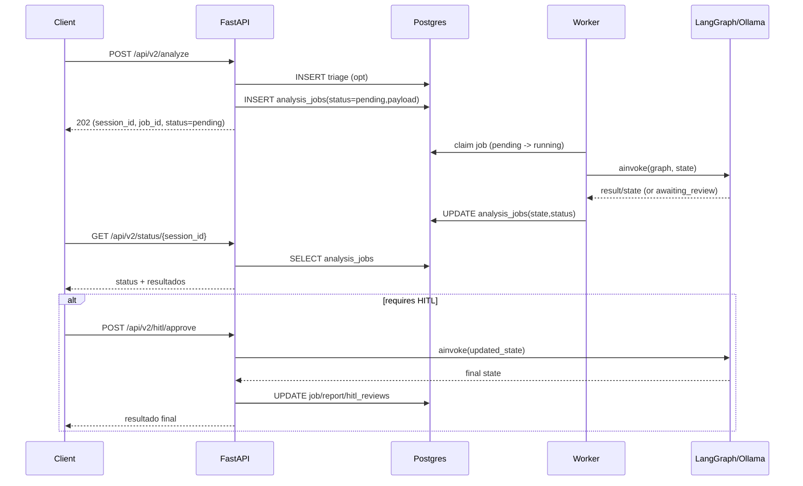

## Relatório Completo para Produção (Mundo Real) — MedSafe (2026-01-14)

Este relatório consolida uma análise minuciosa do repositório, com foco em **segurança, performance, API, escalabilidade, database, observabilidade e gaps funcionais** para operar em cenário real (HealthTech / risco clínico / LGPD).

### Visão geral do sistema

- **Tipo de arquitetura**: monólito modular (FastAPI) + **worker** assíncrono (fila baseada em DB) + serviços auxiliares (Postgres/pgvector, Redis, Ollama, Nginx, Prometheus/Grafana).
- **Pontos de entrada**:
  - API: `backend/app/main.py`
  - Worker: `backend/app/workers/analysis_worker.py`
- **Persistência**:
  - Postgres: triagens/relatórios/jobs/HITL/auditoria/usuários + pgvector
  - Redis: cache + rate limiting (produção)

### Diagramas (alto nível)

```mermaid
flowchart LR
  client[Client/Frontend] -->|HTTPS| nginx[Nginx]
  nginx --> api[FastAPI API\nbackend/app/main.py]
  api --> db[(Postgres + pgvector)]
  api --> redis[(Redis)]
  api --> ollama[Ollama\nLocal LLM/VLM]
  api -->|POST /api/v2/analyze| jobs[(analysis_jobs)]
  worker[Worker\nanalysis_worker.py] -->|claim pending| jobs
  worker -->|run graph| lg[LangGraph Multi-Agent]
  lg --> ollama
  lg --> db
  worker -->|update state/status| jobs
  api -->|GET /api/v2/status/{session_id}| jobs
  api -->|POST /api/v2/hitl/approve| lg
```



---

## Achados e Recomendações (por tópico)

### Segurança & Compliance (LGPD) — **prioridade máxima**

- **Autenticação e RBAC**:
  - JWT tem boas práticas (issuer/audience, whitelist de algoritmos, expiração).
  - **Recomendação**: garantir revogação ativa em Redis em produção e política clara de rotação (`jwt_key_version`).
  - **Recomendação**: padronizar auditoria (eventos, request_id, ip) e revisar retenção.

- **Uploads (OCR/Vision)**:
  - Upload deve validar conteúdo real (magic-bytes para PDF e decodificação real para imagens).
  - **Status**: aplicado reforço mínimo de validação em `backend/app/routers/vision.py`.

- **CORS/CSP/TLS**:
  - `backend/app/config.py` impede `*` em produção (bom).
  - CSP atual ainda permite `'unsafe-inline'` (tradeoff aceitável para CDN, mas **não ideal** para produção).
  - **Recomendação**: buildar assets (remover inline) e endurecer CSP gradualmente.
  - **Recomendação**: HSTS preferencialmente só no edge (Nginx), evitando duplicidade/confusão.

- **Logs e dados sensíveis (PHI/PII)**:
  - É crítico **não logar** medicações/patient_data em plaintext.
  - **Status**: removidos logs em plaintext em pontos de LangGraph/serviços (ex.: Clinical/Document/DrugInteractions). Ainda recomenda-se uma camada de *redaction* central (logger filter).

### Matriz de riscos (Top 12)

| ID | Severidade | Tópico | Problema | Impacto | Ação recomendada | Esforço |
|---:|:--:|---|---|---|---|:--:|
| R1 | 🔴 | LGPD/Logs | Persistência de estado/relatório pode conter PHI (DB `analysis_jobs.state`) | Compliance, vazamento | Retenção + criptografia at-rest + RBAC rigoroso + redaction em logs | M |
| R2 | 🔴 | HITL | Checkpointing LangGraph ainda usa `MemorySaver` | Perda de continuidade após restart | Migrar para `AsyncPostgresSaver` (durável) ou garantir resume 100% via DB | M |
| R3 | 🔴 | Worker | Claim de job sem SKIP LOCKED | Conflito em escala horizontal | Implementar claim atômico (SQL `FOR UPDATE SKIP LOCKED`/`UPDATE..RETURNING`) | M |
| R4 | 🔴 | Segurança | Superfície legacy (arquivos/rotas/serviços antigos) | Ataque/manutenção | Remover/desabilitar legado via feature flags e limpeza | M |
| R5 | 🟡 | CSP | `'unsafe-inline'` em produção | XSS risk | Pipeline de build (CSS/JS) + CSP mais restrita | M |
| R6 | 🟡 | Observabilidade | Métricas sem tracing/correlation completo | Debug difícil | Propagar request_id para audit_logger e logs; opcional OTel tracing | M |
| R7 | 🟡 | DB | Defaults/flags condicionais por env (ex. `DATABASE_URL`) | Inconsistência | Basear lógica no dialect/engine, não em env string | P |
| R8 | 🟡 | Dependências | libs redundantes (`psycopg2` + `psycopg3`, `requests` + `httpx`) | Conflitos | Consolidar stack (prefer `psycopg3` + `httpx`) | P |
| R9 | 🟡 | API | Sem idempotência em `/analyze` | Jobs duplicados | `Idempotency-Key` + dedupe por hash de payload/time window | M |
| R10 | 🟢 | Metrics | Labels agora normalizadas (corrigido) | — | Manter padronização e revisar buckets/alerts | P |
| R11 | 🟢 | Segurança | Upload Vision validado (corrigido) | — | Considerar `python-magic`/ClamAV para alta segurança | M |
| R12 | 🟢 | Config | `ALLOW_ANONYMOUS_ANALYSIS` default seguro (corrigido) | — | Manter false em prod; documentar demo/dev | P |

### API (contratos e UX para integrações)

- **V2 está bem estruturada**: `POST /api/v2/analyze` + `GET /api/v2/status/{session_id}` + HITL.
- **Recomendação**: idempotência em `/analyze` (header `Idempotency-Key`) para evitar jobs duplicados em retries de clientes.
- **Recomendação**: padronizar formato de erro (schema único) e documentar exemplos no OpenAPI.
- **Recomendação**: revisar endpoints legacy e remover/ocultar os não utilizados (reduz superfície).

### Database & Dados

- **Migrations (Alembic)**: forte base (tabelas + índices + pgvector).
- **Índices**: há migrações específicas para queries comuns (`analysis_jobs`, `hitl_reviews`, `drug_interactions`).
- **Recomendação**: alinhar `backend/app/db/models.py` para não depender de `DATABASE_URL` para lógica de Postgres/SQLite (risco de drift por env).
- **Recomendação**: definir política de retenção para `analysis_jobs.state` (pode conter PHI) e estratégia de criptografia at-rest (DB/volume).

### Performance

- **Caches**: `backend/app/utils/cache.py` suporta Redis TTL cache (bom para produção).
- **RAG**: `backend/app/db/vector_store.py` usa cache e híbrido (semantic + keyword).
- **Observabilidade**: corrigido risco de **alta cardinalidade** em métricas (labels por rota template em `middleware/prometheus.py`).
- **Recomendação**: evitar chamadas sync dentro de async (ex.: `requests` dentro de async health check; preferir `httpx`).

### Escalabilidade & Operação

- **Worker DB-queue**: simples e bom para single-VM; para escalar horizontalmente, melhorar “claim” do job (`SELECT ... FOR UPDATE SKIP LOCKED`/`UPDATE ... RETURNING`).
- **Docker prod**: `docker-compose.prod.yml` impõe passwords sem defaults e usa Redis em rate limit (bom).
- **Nginx**: TLS, rate limit no edge e headers (bom).
- **Recomendação**: runbook de incidentes + alertas (latência, fila HITL, falhas LLM, erro 5xx).

### Redundâncias / Dívida Técnica

- **Legacy vs LangGraph**: coexistem `backend/app/agents/*` (legado) e `backend/app/langgraph_agents/*` (novo). Isso aumenta manutenção e risco de comportamento divergente.
- **Routers v1 não usados**: ex.: `backend/app/routers/human_review.py` (não registrado no `main.py`).
- **Checkpointer LangGraph**: módulo de checkpointing usa `MemorySaver`. Para HITL “de verdade”, avaliar migração para `AsyncPostgresSaver` (durabilidade).

### Redundâncias identificadas (lista objetiva)

- **Código legado duplicado**: `backend/app/agents/*` vs `backend/app/langgraph_agents/*` (duas implementações de agentes).
- **Serviço duplicado/confuso**: `backend/services/openfda_service.py` faz import de `app.services...` (potencialmente inválido no runtime padrão).
- **Rotas v1 fora do caminho**: `backend/app/routers/human_review.py` existe mas não é registrado no `main.py`.
- **Dependências duplicadas**: `psycopg2-binary` e `psycopg[binary,pool]` no `requirements.txt`; `requests` e `httpx` coexistindo (preferir um padrão).
- **Documentação duplicada**: `docs/ANALISE_COMPLETA_PRODUCAO.md` e `docs/ANALISE_PRODUCAO_COMPLETA.md` (risco de divergência).

---

## Mudanças aplicadas nesta análise (quick wins implementados)

- **Auth/DB/Audit**: correções de runtime e alinhamento com `user_sessions` + revogação async no dependency JWT.
- **Segurança**:
  - Default mais seguro: `ALLOW_ANONYMOUS_ANALYSIS` padrão `false` no `docker-compose.yml` e `env.example`.
  - Upload Vision: validação de conteúdo real (PDF/image), não só `Content-Type`.
  - Logs: remoção de logs em plaintext de medicações em pontos críticos.
- **Observabilidade**: mitigação de cardinalidade de labels no Prometheus middleware.
- **Ferramenta interna**: `scripts/security_check.py` ajustado para reduzir falsos positivos e refletir wiring real.

---

## Checklist de Go-Live (resumo)

- **Segurança**: secrets rotacionados, CORS/hosts explícitos, uploads validados, logs com redaction, RBAC revisado.
- **DB**: migrations aplicadas (`alembic upgrade head`), backups testados, índices confirmados.
- **Operação**: Redis habilitado, rate limiting redis, alertas Prometheus, dashboards Grafana.
- **Qualidade clínica**: métricas (accuracy/confidence), governança e validação por profissionais, SLA HITL.
- **Privacidade**: retenção + acesso + auditoria + política LGPD (DPA, incident response).

---

## Plano priorizado (0-30-90 dias)

- **0-7 dias (🔴)**: hardening LGPD/log redaction completo, política de retenção, validação de uploads, teste de carga básico, alertas críticos.
- **8-30 dias (🟡)**: idempotência em `/analyze`, melhorar claim do worker, padronizar erros, endurecer CSP removendo `unsafe-inline`.
- **31-90 dias (🟢/🟡)**: checkpointing durável LangGraph (AsyncPostgresSaver), melhoria de escalabilidade (multi-workers), governança de modelos/dados, E2E automation.


