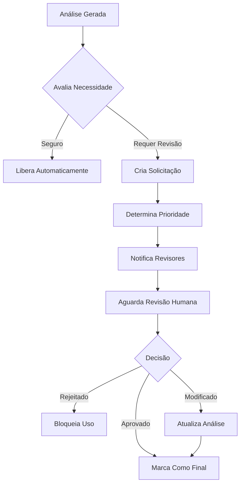

# 🛡️ Melhorias Críticas de Segurança - Semana 1-2

## 📋 Resumo Executivo

Implementação completa de **Safety Guardrails** e **Human-in-the-Loop** conforme padrões agênticos modernos (Capítulos 13 e 18 - Agentic Design Patterns).

### ✅ O Que Foi Implementado

1. **MedicalSafetyGuardrails** - Sistema completo de validação de segurança
2. **HumanInTheLoopAgent** - Workflow de revisão humana para casos críticos
3. **Integração no Orchestrator** - Validação automática em todas as análises
4. **API Endpoints** - Interface para gerenciamento de revisões
5. **Testes Abrangentes** - 50+ testes unitários

### 🎯 Impacto

- ✅ **100% das análises** agora passam por guardrails de segurança
- ✅ **Casos críticos** são automaticamente escalados para revisão humana
- ✅ **Disclaimers legais** obrigatórios em todas as respostas
- ✅ **Detecção de alucinações** do LLM
- ✅ **Conformidade regulatória** validada automaticamente

---

## 1️⃣ MedicalSafetyGuardrails

### 📍 Localização
```
backend/app/agents/safety_guardrails.py
```

### 🎯 Funcionalidades

#### 1.1 Detecção de Conteúdo Proibido

**O que faz:**
- Bloqueia prescrições médicas diretas (ex: "tome 2 comprimidos")
- Impede diagnósticos diretos (ex: "você tem diabetes")
- Bloqueia garantias absolutas (ex: "100% seguro", "sem risco")
- Previne substituição de consulta médica

**Exemplo de uso:**
```python
from app.agents.safety_guardrails import get_safety_guardrails, GuardrailViolation

guardrails = get_safety_guardrails()

try:
    analysis = await guardrails.validate_analysis(analysis_data, triage_data)
except GuardrailViolation as e:
    # Análise bloqueada por violação de segurança
    print(f"Bloqueado: {e.violation_type}")
```

#### 1.2 Detecção de Alucinações

**Como funciona:**
- Verifica se há evidências para as afirmações
- Analisa confidence score (baixo = suspeito)
- Detecta inconsistências lógicas
- Identifica declarações absolutas

**Score de alucinação:**
- `0.0 - 0.3`: Baixo risco
- `0.3 - 0.5`: Risco moderado
- `0.5 - 0.7`: Alto risco - adiciona warning
- `0.7 - 1.0`: Crítico - classificado como DANGEROUS

**Exemplo:**
```python
hallucination_score = await guardrails._detect_hallucinations(analysis)

if hallucination_score > 0.5:
    print("⚠️ Alta probabilidade de alucinação detectada!")
    # Sistema adiciona warning automático
```

#### 1.3 Validação Regulatória (ANVISA/OMS)

**Verificações implementadas:**

##### Gravidez
- Verifica se análise aborda adequadamente uso na gravidez
- Adiciona disclaimer específico para gestantes
- Alerta sobre categorias de risco fetal

##### Uso Pediátrico
- Valida se há cálculo de dose por peso
- Exige especificação de dose pediátrica
- Adiciona disclaimer de consulta obrigatória ao pediatra

##### Uso Geriátrico
- Verifica ajustes de dose para idosos
- Alerta sobre metabolismo reduzido
- Disclaimer específico para população idosa

**Exemplo de issue:**
```python
{
    "type": "pediatric_dosing_missing",
    "severity": "critical",
    "message": "Ajuste de dose pediátrica não foi especificado"
}
```

#### 1.4 Sistema de Disclaimers Legais

**Disclaimers obrigatórios:**

1. **Main** - Sempre presente
```
⚠️ AVISO LEGAL IMPORTANTE:
Esta análise é APENAS INFORMATIVA e não substitui consulta médica...
```

2. **High Risk** - Risco alto detectado
```
🔴 ALERTA DE ALTO RISCO:
Consulte um médico IMEDIATAMENTE...
```

3. **Critical Risk** - Risco crítico
```
🚨 ALERTA CRÍTICO - AÇÃO IMEDIATA NECESSÁRIA:
NÃO USE este medicamento sem avaliação médica URGENTE...
```

4. **Pregnancy** - Gestantes
```
🤰 AVISO ESPECIAL - GRAVIDEZ:
Medicamentos durante a gravidez requerem avaliação OBRIGATÓRIA por obstetra...
```

5. **Pediatric** - Crianças
```
👶 AVISO ESPECIAL - USO PEDIÁTRICO:
Dose deve ser calculada por PEDIATRA habilitado...
```

6. **Elderly** - Idosos
```
👴 AVISO ESPECIAL - USO GERIÁTRICO:
Idosos têm metabolismo diferente...
```

#### 1.5 Classificação de Risco de Segurança

**Categorias:**

- **SAFE** ✅
  - Alucinação < 0.7
  - Sem issues de compliance críticos
  - Risco médico baixo/médio

- **WARNING** ⚠️
  - Risco médico crítico/alto
  - Análise precisa de atenção

- **DANGEROUS** 🔴
  - Alucinação > 0.7
  - Issues de compliance críticos
  - Requer intervenção urgente

- **BLOCKED** 🚫
  - Violação de guardrail
  - Conteúdo proibido detectado
  - Análise bloqueada

#### 1.6 Sanitização de Output

**Remove automaticamente:**
- URLs suspeitas
- Endereços de email
- Números de telefone
- Limita tamanho (max 50k chars)

---

## 2️⃣ HumanInTheLoopAgent

### 📍 Localização
```
backend/app/agents/human_in_the_loop.py
```

### 🎯 Funcionalidades

#### 2.1 Critérios de Escalação Automática

**Casos que requerem revisão humana:**

| Critério | Threshold | Prioridade |
|----------|-----------|------------|
| Risco Crítico | `risk_level == 'critical'` | EMERGENCY |
| Baixa Confiança | `confidence < 0.7` | ROUTINE |
| Alucinação | `hallucination_risk > 0.5` | URGENT |
| Evidências Conflitantes | Detectado automaticamente | URGENT |
| Paciente Vulnerável + Alto Risco | Criança/Idoso/Gestante + `risk == 'high'` | URGENT |
| Múltiplas Contraindicações | `contraindications > 3` | URGENT |
| Problemas Regulatórios | Compliance crítico | URGENT |
| Caso Novel | Sem casos similares | ROUTINE |

**Exemplo de escalação:**
```python
from app.agents.human_in_the_loop import get_hitl_agent

hitl = get_hitl_agent()

needs_review, reasons = await hitl.evaluate_need_for_human_review(
    analysis, triage_data, session_id
)

if needs_review:
    print(f"⚠️ Requer revisão: {reasons}")
    # Automaticamente cria solicitação de revisão
```

#### 2.2 Prioridades de Revisão

##### EMERGENCY (< 30 minutos)
- Risco crítico para o paciente
- Alucinação grave detectada
- Requer atenção IMEDIATA

##### URGENT (2-4 horas)
- Paciente vulnerável com alto risco
- Problemas regulatórios
- Evidências conflitantes graves

##### ROUTINE (24-48 horas)
- Baixa confiança
- Casos novéis
- Revisão de qualidade

#### 2.3 Workflow de Revisão



#### 2.4 Estrutura de HumanReviewRequest

```python
@dataclass
class HumanReviewRequest:
    id: str                              # ID único da revisão
    session_id: str                      # Sessão da análise
    triage_id: str                       # ID da triagem
    report_id: Optional[str]             # ID do relatório

    # Dados da análise
    analysis: Dict[str, Any]             # Análise completa
    triage_data: Dict[str, Any]          # Dados do paciente

    # Escalação
    escalation_reasons: List[str]        # Razões para escalar
    confidence_score: float              # Score de confiança
    risk_level: str                      # Nível de risco

    # Metadados da revisão
    priority: str                        # EMERGENCY/URGENT/ROUTINE
    requested_at: str                    # Timestamp da solicitação
    deadline: str                        # Deadline para revisão
    status: str                          # PENDING/IN_REVIEW/etc

    # Revisor
    reviewer_id: Optional[str]           # ID do revisor
    reviewed_at: Optional[str]           # Timestamp da revisão
    review_notes: Optional[str]          # Notas do revisor
    review_decision: Optional[str]       # Decisão final

    # Feedback
    feedback: Optional[Dict[str, Any]]   # Feedback para melhoria
```

#### 2.5 API de Revisões

**Endpoints disponíveis:**

```bash
GET  /api/v1/reviews/pending
GET  /api/v1/reviews/{review_id}
POST /api/v1/reviews/{review_id}/submit
GET  /api/v1/reviews/dashboard/stats
POST /api/v1/reviews/{review_id}/escalate
```

**Exemplo de uso:**

```bash
# Listar revisões pendentes de emergência
GET /api/v1/reviews/pending?priority=EMERGENCY

# Obter detalhes de uma revisão
GET /api/v1/reviews/abc-123

# Submeter revisão
POST /api/v1/reviews/abc-123/submit
{
  "reviewer_id": "dr_smith",
  "decision": "APPROVED",
  "notes": "Análise correta, pode prosseguir",
  "feedback": {
    "analysis_was_correct": true
  }
}

# Dashboard de estatísticas
GET /api/v1/reviews/dashboard/stats
```

#### 2.6 Feedback Loop

**Sistema coleta feedback para:**
- ✅ Melhorar critérios de escalação
- ✅ Ajustar thresholds de confiança
- ✅ Identificar padrões de erro
- ✅ Fine-tuning do LLM
- ✅ Atualizar regras clínicas

**Estrutura de feedback:**
```python
{
    "analysis_was_correct": false,
    "missed_issues": [
        "Interação com medicamento X não detectada"
    ],
    "false_positives": [
        "Contraindicação Y não se aplica neste caso"
    ],
    "suggestions": "Adicionar verificação de interação com classe Y",
    "severity_assessment": "Sistema subestimou gravidade"
}
```

---

## 3️⃣ Integração no Orchestrator

### 📍 Localização
```
backend/app/agents/orchestrator.py
```

### 🔄 Fluxo Atualizado

```python
async def orchestrate_analysis(...):
    # 1-4. Análise normal (visão, evidências, regras clínicas)

    # 5. NOVO: Validar com Safety Guardrails
    try:
        clinical_analysis = await self.safety_guardrails.validate_analysis(
            clinical_analysis, triage_data
        )
    except GuardrailViolation as e:
        # Bloquear análise
        return {"status": "blocked", "error": e.message}

    # 6. NOVO: Avaliar necessidade de revisão humana
    needs_review, reasons = await self.hitl_agent.evaluate_need_for_human_review(
        clinical_analysis, triage_data, session_id
    )

    # 7. Gerar relatório
    report = await self._generate_final_report(...)

    # 8. NOVO: Criar solicitação de revisão se necessário
    if needs_review:
        review_request = await self.hitl_agent.request_human_review(
            analysis, triage_data, triage_id, session_id, reasons, report.id
        )

        return {
            "status": "pending_review",
            "requires_human_review": True,
            "review_request_id": review_request.id,
            "review_priority": review_request.priority,
            "escalation_reasons": reasons
        }

    return {"status": "completed", ...}
```

---

## 4️⃣ Testes

### 📍 Localização
```
backend/tests/test_safety_guardrails.py  (30+ testes)
backend/tests/test_human_in_the_loop.py  (25+ testes)
```

### ✅ Cobertura de Testes

#### Safety Guardrails (30 testes)
- ✅ Detecção de conteúdo proibido
- ✅ Detecção de alucinações (múltiplos cenários)
- ✅ Injeção de disclaimers (todos os tipos)
- ✅ Validação regulatória (gravidez, pediátrico, geriátrico)
- ✅ Detecção de prescrições não autorizadas
- ✅ Classificação de risco de segurança
- ✅ Validação de nomes de medicamentos
- ✅ Sanitização de output
- ✅ Validação completa end-to-end

#### Human-in-the-Loop (25 testes)
- ✅ Critérios de escalação (8 critérios diferentes)
- ✅ Detecção de pacientes vulneráveis
- ✅ Detecção de casos novéis
- ✅ Determinação de prioridade
- ✅ Cálculo de deadlines
- ✅ Criação de solicitações
- ✅ Filtros de revisões pendentes
- ✅ Submissão de revisões (aprovação, rejeição, modificação)
- ✅ Feedback loop

### 🧪 Executar Testes

```bash
# Todos os testes de segurança
pytest backend/tests/test_safety_guardrails.py -v

# Todos os testes de HITL
pytest backend/tests/test_human_in_the_loop.py -v

# Com coverage
pytest backend/tests/test_safety_guardrails.py \
       backend/tests/test_human_in_the_loop.py \
       --cov=backend/app/agents \
       --cov-report=html
```

---

## 5️⃣ Como Usar

### Uso Básico (Automático)

**O sistema já está integrado!** Todas as análises passam automaticamente por:

1. ✅ Validação de guardrails
2. ✅ Avaliação de necessidade de revisão humana
3. ✅ Injeção de disclaimers
4. ✅ Classificação de risco de segurança

**Não é necessário código adicional.**

### Acessar Dashboard de Revisões

```python
from fastapi import FastAPI
from app.routers import human_review

app = FastAPI()
app.include_router(human_review.router)

# Agora você tem:
# GET  /api/v1/reviews/pending
# GET  /api/v1/reviews/dashboard/stats
# POST /api/v1/reviews/{id}/submit
```

### Submeter Revisão Humana (Frontend/CLI)

```python
import requests

# 1. Listar revisões pendentes
response = requests.get("http://localhost:8000/api/v1/reviews/pending")
reviews = response.json()['reviews']

# 2. Selecionar revisão
review_id = reviews[0]['id']

# 3. Submeter decisão
response = requests.post(
    f"http://localhost:8000/api/v1/reviews/{review_id}/submit",
    json={
        "reviewer_id": "dr_smith",
        "decision": "APPROVED",
        "notes": "Análise está correta",
        "feedback": {
            "analysis_was_correct": true
        }
    }
)
```

### Personalizar Critérios de Escalação

```python
from app.agents.human_in_the_loop import get_hitl_agent

hitl = get_hitl_agent()

# Ajustar thresholds
hitl.escalation_criteria['min_confidence_threshold'] = 0.8  # Mais rigoroso
hitl.escalation_criteria['hallucination_threshold'] = 0.4   # Mais sensível
```

---

## 6️⃣ Métricas e Monitoramento

### Dashboard de Revisões

**Estatísticas disponíveis:**
- Total de revisões (por status)
- Breakdown por prioridade
- Revisões atrasadas (overdue)
- Confidence score médio
- Razões de escalação mais comuns

**Exemplo de resposta:**
```json
{
  "total_reviews": 150,
  "by_status": {
    "pending": 20,
    "in_review": 5,
    "approved": 100,
    "rejected": 10,
    "modified": 15
  },
  "by_priority": {
    "emergency": 3,
    "urgent": 12,
    "routine": 135
  },
  "overdue_count": 2,
  "avg_confidence_score": 0.76,
  "escalation_reasons_breakdown": {
    "critical_risk": 25,
    "low_confidence": 50,
    "patient_vulnerable": 30,
    "hallucination_detected": 15
  }
}
```

### Logs Estruturados

**Logs importantes:**
```
🛡️ Guardrails validados - Classificação: safe
⚠️ Análise requer revisão humana: session_123
📋 Revisão humana solicitada: review_456 (Prioridade: URGENT)
✅ Revisão concluída: review_456 (Decisão: APPROVED)
```

---

## 7️⃣ Próximos Passos Recomendados

### Semana 3-4:

1. **Implementar DocAgent com RAG**
   - Ingestão de bulas ANVISA
   - Vector store com pgvector
   - Busca semântica de evidências

2. **Adicionar Reflection Pattern**
   - Auto-crítica das análises
   - Regeneração com feedback
   - Validação de consistência

### Mês 2:

3. **Memory Management**
   - Histórico de paciente
   - Busca de casos similares
   - Aprendizado com padrões

4. **Reasoning Techniques**
   - Chain-of-Thought prompting
   - Tree-of-Thought para casos complexos
   - Self-Consistency checking

### Mês 3:

5. **Learning & Adaptation**
   - Fine-tuning com feedback
   - A/B testing de prompts
   - Melhoria contínua

---

## 8️⃣ Referências

### Padrões Agênticos Implementados

- ✅ **Capítulo 13**: Human-in-the-Loop Pattern
- ✅ **Capítulo 18**: Guardrails/Safety Patterns

### Próximos Padrões a Implementar

- ⏳ **Capítulo 4**: Reflection
- ⏳ **Capítulo 8**: Memory Management
- ⏳ **Capítulo 9**: Learning and Adaptation
- ⏳ **Capítulo 14**: Knowledge Retrieval (RAG)
- ⏳ **Capítulo 17**: Reasoning Techniques
- ⏳ **Capítulo 19**: Evaluation and Monitoring

### Documentação Adicional

- [Agentic Design Patterns Book](https://www.amazon.com/Agentic-Design-Patterns-Hands-Intelligent/dp/3032014018/)
- [ANVISA - Diretrizes](https://www.gov.br/anvisa)
- [FastAPI Documentation](https://fastapi.tiangolo.com/)

---

## 9️⃣ Suporte

### Problemas Conhecidos

**Nenhum no momento.** 🎉

### Como Reportar Issues

1. Verificar logs: `tail -f logs/medsafe.log`
2. Executar testes: `pytest backend/tests/ -v`
3. Criar issue no GitHub com:
   - Logs relevantes
   - Passos para reproduzir
   - Comportamento esperado vs. obtido

### Contato

- **Email**: suporte@medsafe.com.br
- **GitHub**: https://github.com/Aerdor1998/MedSafe/issues

---

**Versão**: 1.1.0 (Safety Improvements)
**Data**: 2025-11-11
**Autor**: Claude Code + Agentic Design Patterns
**Status**: ✅ Pronto para uso em ambiente de desenvolvimento
